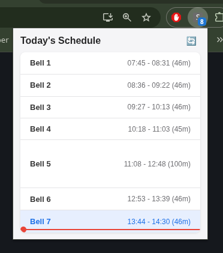

# 🕒 Bell Tracker (Chrome Extension)

A lightweight, privacy-first Chrome Extension designed for teachers and administrative assistants that displays the active class bell period and a live countdown timer directly inside the extension icon badge area. 

By pulling real-time schedules directly from your existing SmartPass session, this extension entirely eliminates the guesswork of 4-day rotating block schedules, unexpected pep rallies, mid-day adjustments, or emergency delay schedules.



---

## ✨ Features

- **Zero-Click Live Countdown:** Look right at your extension toolbar to see exactly how many minutes are remaining in the current period (e.g., `14m` displayed directly on the icon).
- **Dynamic Schedule Awareness:** No hardcoded schedules. The tool updates hourly from SmartPass to stay perfectly aligned with snow delays, custom rosters, assembly days, and rolling block switches.
- **Visual Schedule Dropdown:** Click the extension icon to reveal a clean, scannable timeline of the entire school day, highlighting your active location in real-time.
- **Privacy-by-Design Architecture:** Zero servers. Zero analytics tracking. Zero third-party telemetry. All parsing, validation, and session mapping occur strictly within your browser's local sandbox storage (`chrome.storage.local`).

---

## 🏗️ Project Architecture

The extension is engineered strictly under the modern Chrome Extension **Manifest V3** specification, separating concerns across specialized local components:


```
smartpass-bell-tracker/
├── manifest.json       # Structural permissions boundaries & host constraints
├── background.js      # Global decoupled engine worker (identity resolver & time engine)
├── popup.html         # Scannable dropdown interface markup
└── popup.js           # UI coordinator and temporal matching visualizer

```

---

## 🛠️ Installation & Setup

Because this extension operates entirely locally to protect administrative and student data data-flows, it is loaded manually as an unpacked developer utility.

1. **Download the Source:** Clone or extract this codebase folder to a permanent directory on your local machine.
2. **Access Extension Controls:** Open Google Chrome and navigate to `chrome://extensions/`.
3. **Enable Developer Mode:** Toggle the **Developer mode** switch in the upper-right corner of the window.
4. **Load the Extension:** Click the **Load unpacked** button in the top-left corner.
5. **Select Folder:** Select the root directory containing the project files.
6. **Authentication Trigger:** Ensure you are logged into your school's SmartPass platform on Chrome. The extension automatically inherits the authenticated token session cookies to perform secure local API inquiries.

---

## 🔒 Absolute Privacy Commitment

This tool does **not** process, track, or save passwords, PII, or browsing telemetry.

* **Session Piggybacking:** The script uses native `fetch()` calls allowed by explicit host rules to inherit existing browser cookies—meaning your structural account password never crosses into the extension runtime boundaries.
* **Local Sandbox Storage:** Your dynamically fetched day agenda is mapped directly to `chrome.storage.local`. It is written to your local hard drive allocation and is inaccessible to external scripts or cloud indexing engines.

---

## 📄 License

This project is open-source and intended purely for educational and local school administrative workspace optimization.

## Privacy Policy

We believe that student and educator data should remain strictly confidential. This Extension was built with a "Privacy-by-Design" architecture, meaning **it does not collect, track, or transmit any personal data to the developer or any third-party servers.** Read more in the [Privacy Policy](privacy-policy.md).
